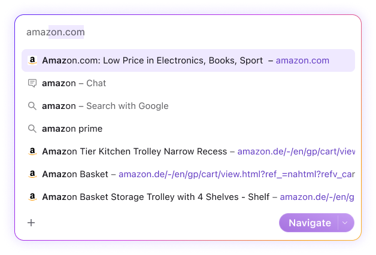
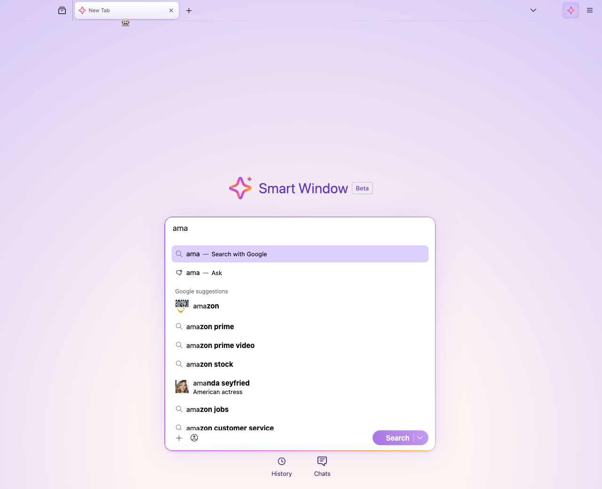

# compare-figma-to-impl

**Stop squinting at Figma and your browser. Diff it.**

A single dropdown has lots of visual properties. Manually checking each one against Figma is slow, painful and error prone — font weight 700 instead of 590, gradient angle off by 34 degrees, padding short by 2.5px. This skill does the comparison automatically.

Point it at a Figma URL and a running UI in Firefox:

| Property | Figma | Implementation | Match? |
|---|---|---|---|
| Bold highlight weight | **590** (Semibold) | **700** (Bold) | Different |
| Action text color | `rgba(21,20,26,0.69)` | `rgb(0,0,0)` | Different |
| Button gradient | `linear-gradient(201deg, ...)` | `linear-gradient(235deg, ...)` | Different angle |
| Container border | `1px solid #321bfd` | Gradient border via `::after` | Different |
| Row inner padding | 10px | 7.5px | Different |
| Selected row background | `#efe9ff` | `oklch(0.9 0.13 290)` | Close |
| Border radius | 16px | 16px | Match |

*Excerpt from a [real report](evals/samples/aiwindow-smartbar-dropdown/report.md) — the full comparison found 2 critical, 12 minor, and 8 non-issue discrepancies in a single dropdown component.*

| Figma | Implementation |
|:---:|:---:|
|  |  |

### Use it before you code

Run the comparison before you start implementing and the output is your checklist — every property the implementation needs to match, with exact values. Feed it to an LLM coding agent as acceptance criteria, or use it as a reference yourself.

```
/compare-figma-to-impl https://www.figma.com/design/FILE_KEY/File-Name?node-id=1-42 to the smartbar dropdown
```

Run it after implementation to catch mismatches before review. Each discrepancy is classified as Critical (visually broken), Minor (measurable difference), or Non-issue (numerically different but visually identical). The report includes side-by-side screenshots for each finding.

See example reports: [toolbar button](evals/samples/simple-toolbar-button/report.md) | [smartbar dropdown](evals/samples/aiwindow-smartbar-dropdown/report.md)

---

> **Alpha** — This skill works but setup and configuration docs are incomplete. Expect some rough edges getting the MCP servers connected and configured. Better install/usage instructions are coming.

## Prerequisites

- [Claude Code](https://docs.anthropic.com/en/docs/claude-code) with this plugin installed
- [Figma MCP server](https://github.com/nichochar/figma-mcp) connected, with `FIGMA_TOKEN` set
- [Firefox DevTools MCP server](https://github.com/nichochar/firefox-devtools-mcp) connected
- The target UI visible in a Firefox tab

## Usage

With the prerequisites running, invoke the skill from Claude Code:

```
/compare-figma-to-impl https://www.figma.com/design/FILE_KEY/File-Name?node-id=1-42 to the AI window header 
```
