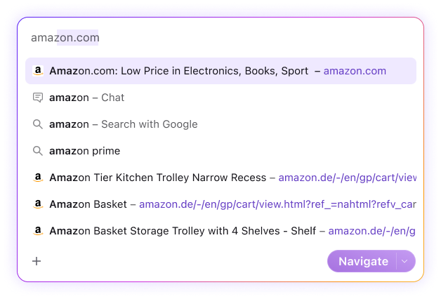
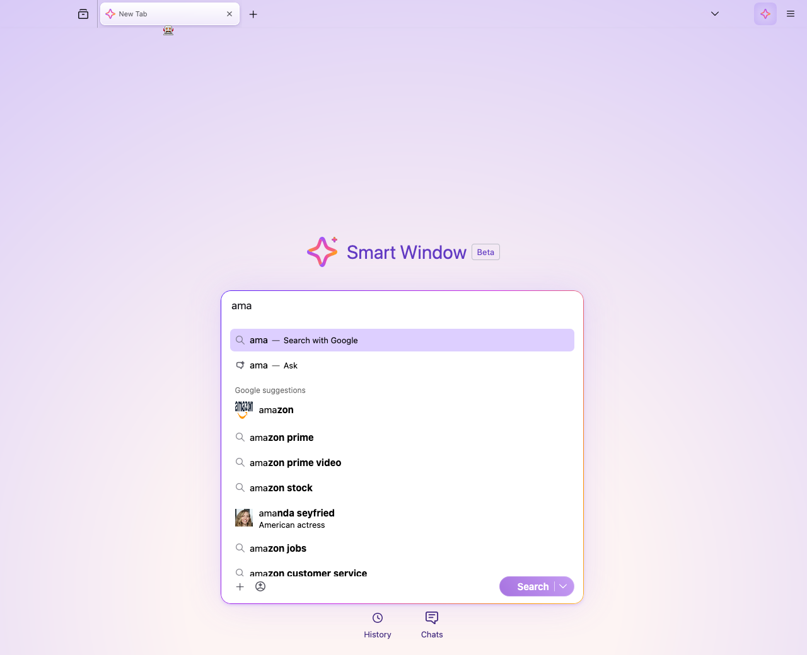
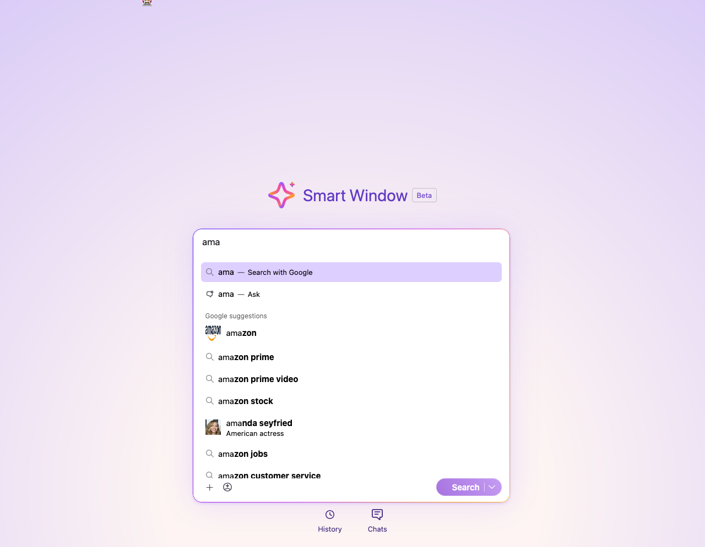

# Figma vs Implementation Comparison: Smartbar Dropdown

## Context

- **Figma**: [AI Mode - MVP Scope Design, node 18801:40805](https://www.figma.com/design/5KuePTGmOEUFyCHBHCsGim/AI-Mode-%E2%80%94%C2%A0MVP-Scope-Design?node-id=18801-40805&m=dev)
- **Implementation**: AI Window smartbar dropdown (`moz-smartbar` > `.urlbarView`), accessed via `gBrowser.selectedBrowser.contentDocument` > `ai-window` > shadowRoot
- **Screenshots**: `comparison/figma-screenshot.png`, `comparison/impl-screenshot.png`

### Overview Screenshots

| Figma | Implementation |
|:---:|:---:|
|  |  |

## Layout & Styling

### Container

| Property | Figma | Implementation | Match? |
|---|---|---|---|
| Background | `rgba(255,255,255,0.6)` (semi-transparent white) | `rgb(255,255,255)` (solid white) + `::before` purple overlay at `color(srgb 0.619 0.477 1.094 / 0.3)` opacity 0.7 | Different technique |
| Border | `1px solid #321bfd` (solid blue) | `::after` gradient border: `linear-gradient(117deg, #321bfd -17.87%, #cf30e2 52.93%, #ff9900 89.02%, #f5c451 109.44%)` via 1px padding trick | Different |
| Border radius | 16px | 16px | Match |
| Box shadow | `0px 0px 24px rgba(158,122,255,0.3)` | `color(srgb 0.545 0.362 1.038 / 0.15) 0px 0.25px 0.75px, color(srgb 0.545 0.362 1.038 / 0.25) 0px 2px 6px` | Different |
| Padding (container) | 12px | 0px (results area: `11.25px 15px`) | Similar effective |
| Width | 557px (inner content) | 576px | Different |

### Dropdown Rows

| Property | Figma | Implementation | Match? |
|---|---|---|---|
| Row height | 38px | 40px (standard), 47px (rich suggestion) | Different |
| Row inner padding | 10px | 7.5px | Different |
| Selected row background | `#efe9ff` | `oklch(0.9 0.13 290)` (~light purple) | Close |
| Selected row border-radius | 8px | 9px | Close |
| Icon-to-title gap | 8px | 7.5px | Close |
| Row width | 557px | 550px | Close |

### Typography

| Property | Figma | Implementation | Match? |
|---|---|---|---|
| Font family | SF Pro | `-apple-system` | Close (resolves to SF Pro on macOS) |
| Title font size | 15px | 15px | Match |
| Title font weight (normal) | 400 | 400 | Match |
| **Bold match highlight weight** | **590 (Semibold)** | **700 (Bold)** | **Different** |
| Title color | `#15141a` | `rgb(0,0,0)` (black) | Different |
| Action text color | `rgba(21,20,26,0.69)` (deemphasized) | `rgb(0,0,0)` (black) | Different |
| URL color | `#623ac3` | `oklch(0.48 0.2 290)` (~purple) | Close |
| Action font size | 15px (inline with title) | 13px (separate element) | Different |
| Title-action separator | ` -- ` (en-dash with spaces) | `::before` content `"---"` (em-dash) with 6px margin | Different character |
| Input text size | 16.4px (`font/size/large`) | 17px | Close |
| Input text color | `rgba(21,20,26,0.69)` (deemphasized) | `rgb(0,0,0)` (black) | Different |

### Icons

| Property | Figma | Implementation | Match? |
|---|---|---|---|
| Standard icon size | 16x16 | 16x16 | Match |
| Rich suggestion icon size | N/A (all 16x16 in Figma) | 28x28 | Different |
| Search icon | Search glass (opacity 0.5) | `search-glass.svg` (no opacity reduction) | Different (opacity) |
| Chat/Ask icon | Speech bubble / notifications-16 (opacity 0.5) | `ask-icon.svg` | Close |
| Favicon icon | Amazon favicon in rounded 2px container | `moz-remote-image://` loaded favicon | Close |
| Icon border-radius (favicons) | 2px | N/A (no rounding visible) | Different |

### Bottom Controls Bar

| Property | Figma | Implementation | Match? |
|---|---|---|---|
| Layout | flex, space-between | flex, left-aligned | Different |
| Padding | `2px 0` (vertical) | `0 15px 11.25px` | Different |
| Left button | `+` icon (add-16) ghost button | `+` icon (plus.svg) context-icon-button | Close |
| Middle button | N/A | Memories toggle button | Extra in impl |
| Right button label | **"Navigate"** | **"Search"** | Dynamic/contextual |
| Button type | Split button (label + dropdown chevron with separator) | Split button (`moz-button type="split"`) | Match |
| Button gradient | `linear-gradient(201deg, #d6b4fd 57%, #8341ca 219%)` | `linear-gradient(235deg, #d6b4fd -57%, #8341ca 219%)` | Different angle |
| Button border-radius | 24px | 9999px (pill) | Non-issue (both pill at this height) |
| Button text color | white | white (`rgb(255,255,255)`) | Match |
| Button font size | 16.4px | 15px | Different |
| Button font weight | 590 | 600 | Close |
| Button border | `1px solid rgba(255,255,255,0.2)` | none | Different |
| Button height | ~32px | 32px | Match |

## Summary of Discrepancies

### Critical

1. **Container border is gradient instead of solid blue**: The Figma design specifies a solid `#321bfd` blue border, but the implementation uses a multi-color gradient border (blue -> pink -> orange -> yellow) via `::after` pseudo-element. This is a fundamentally different visual treatment.

| Figma | Implementation |
|:---:|:---:|
|  |  |

2. **Action text color is black instead of deemphasized**: The "Search with Google" / "Ask" action labels render as `rgb(0,0,0)` (solid black) in the implementation, but the Figma design uses `rgba(21,20,26,0.69)` (deemphasized gray) for these secondary labels. This reduces the visual hierarchy between primary title text and secondary action text.

| Figma | Implementation |
|:---:|:---:|
|  |  |

### Minor

3. **Bold match highlight uses weight 700 instead of 590**: The implementation bolds matched text with `font-weight: 700` (Bold), while the Figma design specifies `font-weight: 590` (Semibold, `NEW/Font/Size/Large/bold` token). This makes matched text appear heavier than intended.

| Figma | Implementation |
|:---:|:---:|
|  |  |

4. **Title text color is pure black instead of near-black**: Implementation uses `rgb(0,0,0)` while Figma specifies `#15141a` (very dark gray). Subtle but consistent difference across all rows.

5. **Search icon missing opacity 0.5**: In Figma, the search glass and chat icons for suggestion rows have `opacity: 0.5`, giving them a lighter appearance. The implementation renders them at full opacity.

| Figma | Implementation |
|:---:|:---:|
|  |  |

6. **Row height is 40px instead of 38px**: Standard rows are 40px in implementation vs 38px in Figma. Rich suggestion rows are 47px (not present in Figma design).

7. **Row inner padding is 7.5px instead of 10px**: Each row's inner content has 7.5px padding vs the Figma spec of 10px.

8. **CTA button font size is 15px instead of 16.4px**: The Search/Navigate button text uses 15px font-size vs the Figma design token `font/size/large` = 16.4px.

| Figma | Implementation |
|:---:|:---:|
|  |  |

9. **CTA button gradient angle**: Implementation uses 235deg vs Figma's 201deg. Color stops also differ in position (-57% vs 57%).

10. **CTA button missing semi-transparent white border**: Figma specifies `1px solid rgba(255,255,255,0.2)` border on the button; implementation has no border.

| Figma | Implementation |
|:---:|:---:|
|  |  |

11. **Box shadow differs significantly**: Figma uses a single large purple glow (`0px 0px 24px rgba(158,122,255,0.3)`), while the implementation uses two smaller, tighter shadows. The Figma glow is more diffuse and prominent.

12. **Container background technique differs**: Figma uses simple `rgba(255,255,255,0.6)`, implementation uses solid white + purple-tinted `::before` overlay. Visual result is similar but the purple tint may be visible in certain conditions.

13. **Separator character**: Figma uses en-dash ` -- ` while implementation uses em-dash `---` with 6px margin. Subtle typographic difference.

14. **Action font size is 13px instead of 15px inline**: In Figma, the action text ("Search with Google", "Chat") appears at the same 15px size inline with the title, separated by a dash. In the implementation, it's a separate 13px element positioned after the title.

### Non-issue

15. **Button border-radius 9999px vs 24px**: Both produce identical pill shapes at 32px height. Non-issue.

16. **Button font weight 600 vs 590**: Visually imperceptible difference (less than 2% weight variation).

17. **Font family `-apple-system` vs `SF Pro`**: On macOS, `-apple-system` resolves to SF Pro. Functionally identical.

18. **Selected row bg `oklch(0.9 0.13 290)` vs `#efe9ff`**: Both are light purple tints. The oklch value should resolve to approximately the same color.

19. **Selected row border-radius 9px vs 8px**: 1px difference, visually negligible.

20. **Icon-to-title gap 7.5px vs 8px**: 0.5px difference, sub-pixel and imperceptible.

21. **Button label "Search" vs "Navigate"**: This is dynamic/contextual based on the selected result type, not a styling bug. The Figma mock shows a specific state.

22. **Memories button in implementation**: This is an additional feature not present in the Figma mock. Not a discrepancy per se, as the design may have been updated or the button added later.
