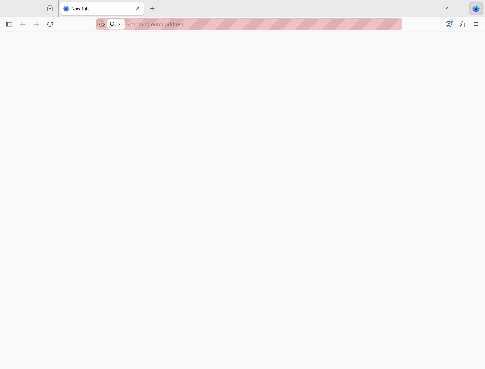
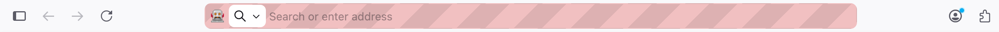
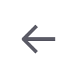
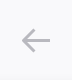
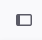

## Context

**Figma design**: [AI Mode - MVP Scope Design, node 8559:44226 (Toolbar)](https://www.figma.com/design/5KuePTGmOEUFyCHBHCsGim/AI-Mode-%E2%80%94%C2%A0MVP-Scope-Design?node-id=8559-44226&m=dev)

**Live UI element**: The first four icon buttons in the top-left of the Firefox nav-bar: `#sidebar-button`, `#back-button`, `#forward-button`, and `#reload-button` (inside `#stop-reload-button`).

**Figma node structure**: The four buttons are the first four children of the "Actions left" group (`I8559:44226;305:3288`) inside the "Toolbar" frame. Each is a `moz-button type="icon ghost"` Code Connect component.

| Figma | Implementation |
|:---:|:---:|
|  |  |

## Summary of Discrepancies

### Critical

None.

### Minor

1. **Left edge padding offset (~4px)**

   The Figma toolbar specifies `padding-left: 4px` at the toolbar container level, placing the first button's outer edge 4px from the window edge. In the implementation, the toolbar (`#nav-bar`) has `padding: 0px`, but `#sidebar-button` compensates with `padding-left: 8px` (vs the standard `2px` outer-padding used by other buttons). This puts the sidebar icon center at x=16 in the implementation vs ~x=12 in Figma - a ~4px rightward shift.

   | Figma | Implementation |
   |:---:|:---:|
   |  |  |

### Non-issue

1. **Gap implementation method (flex gap vs outer-padding)**

   Figma specifies `gap: 4px` on the "Actions left" flex container. The implementation uses `--toolbarbutton-outer-padding: 2px` on each button side instead, producing an identical 4px visual gap between the 32x32 icon areas (2px right pad + 2px left pad = 4px). Visually equivalent.

   | Figma | Implementation |
   |:---:|:---:|
   |  |  |

2. **Disabled state opacity (back/forward buttons)**

   Back and forward buttons render at `opacity: 0.4` in the implementation because they are `disabled="true"` (no navigation history on a New Tab page). The Figma design shows the enabled state at full opacity. This is a runtime state difference, not a design mismatch.

   | Figma (enabled state) | Implementation (disabled state) |
   |:---:|:---:|
   |  |  |

3. **Button outer dimensions vs inner icon area**

   Figma buttons are 32x32 `moz-button` components. Implementation buttons are 36-42px wide x 40px tall, but the inner interactive/visual area (stack/icon container) is 32x32 with 8px padding and 8px border-radius in both cases. The outer button fills the 40px toolbar height for better click targets. The rendered icon is 16x16 centered inside the 32x32 area in all cases.

   | Figma | Implementation |
   |:---:|:---:|
   |  |  |

## Layout & Styling

### Container Properties

| Property | Figma | Implementation | Match? |
|---|---|---|---|
| Toolbar display | flex | flex | Yes |
| Toolbar height | 40px | 40px | Yes |
| Toolbar padding-left | 4px | 0px (handled by sidebar button) | ~Yes |
| Toolbar padding-top/bottom | 4px | 0px (buttons fill height) | ~Yes |
| Toolbar background | Not specified (inherits) | rgb(249, 249, 251) | N/A |
| Actions left display | flex | flex (nav-bar-customization-target) | Yes |
| Actions left gap | 4px | 0px (via 2px outer-padding per side) | Visual match |
| Actions left alignment | items-start | items: normal | ~Yes |

### Button Properties (All Four)

| Property | Figma | Sidebar (impl) | Back/Fwd/Reload (impl) | Match? |
|---|---|---|---|---|
| Component type | moz-button icon ghost | toolbarbutton-1 | toolbarbutton-1 | Equivalent |
| Outer width | 32px | 42px | 36px | Differs (see Non-issue #3) |
| Outer height | 32px | 40px | 40px | Differs (see Non-issue #3) |
| Inner icon area | 32x32 | 32x32 (stack) | 32x32 (icon element) | Yes |
| Icon size | 16x16 | 16x16 | 16x16 (effective) | Yes |
| Inner padding | 8px | 8px (stack) | 8px (icon padding) | Yes |
| Border-radius (hover) | 8px (component default) | 8px (`--toolbarbutton-border-radius`) | 8px | Yes |
| Background (resting) | transparent | transparent | transparent | Yes |
| Border | none | none | none | Yes |

### Icon Details

| Button | Figma Icon | Implementation Icon | Fill Color | Match? |
|---|---|---|---|---|
| Sidebar | Sidebar panel (rounded rect) | `sidebar-collapsed.svg` | #5B5B66 / rgb(91,91,102) | Yes |
| Back | Left arrow | `back.svg` | #5B5B66 / rgb(91,91,102) | Yes |
| Forward | Right arrow | `forward.svg` | #5B5B66 / rgb(91,91,102) | Yes |
| Reload | Circular arrow | `reload.svg` | #5B5B66 / rgb(91,91,102) | Yes |

### Spacing Between Buttons (Visual Gap)

| Gap | Figma | Implementation | Match? |
|---|---|---|---|
| Sidebar to Back | 4px (flex gap) | 4px (2px right pad + 2px left pad) | Yes |
| Back to Forward | 4px (flex gap) | 4px (2px + 2px) | Yes |
| Forward to Reload | 4px (flex gap) | 4px (2px + 2px) | Yes |
